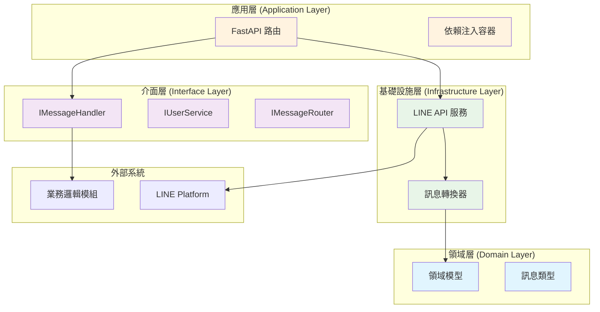

# LINE BOT 通訊模組 - 設定與部署指南

## 🏗️ 架構概覽

本模組採用 Clean Architecture 設計，具有以下分層結構：



## 🚀 快速設定

### 1. LINE Developers Console 設定

1. 登入 [LINE Developers Console](https://developers.line.biz/)
2. 建立新的 Provider 或選擇現有的
3. 建立新的 Channel (Messaging API)
4. 記錄以下資訊：
   - Channel Access Token
   - Channel Secret

### 2. 環境變數設定

複製 `.env.example` 為 `.env`：

```bash
cp .env.example .env
```

編輯 `.env` 檔案：

```bash
# LINE BOT 設定
LINE_CHANNEL_ACCESS_TOKEN=your_actual_channel_access_token
LINE_CHANNEL_SECRET=your_actual_channel_secret

# 伺服器設定
HOST=0.0.0.0
PORT=8000
DEBUG=True

# ngrok 設定 (開發用)
NGROK_URL=https://your-actual-ngrok-url.ngrok.io

# 日誌設定
LOG_LEVEL=INFO
```

### 3. 安裝與啟動

```bash
# 安裝依賴
pip install -r requirements.txt

# 啟動服務
python main.py

# 或使用 uvicorn
uvicorn main:app --reload --host 0.0.0.0 --port 8000
```

### 4. ngrok 設定 (本地開發)

```bash
# 安裝 ngrok (如果尚未安裝)
# 下載：https://ngrok.com/download

# 啟動 ngrok
ngrok http 8000

# 複製產生的 HTTPS URL 到 .env 檔案
# 例如：https://abc123.ngrok.io
```

### 5. LINE Webhook 設定

在 LINE Developers Console 中：

1. 進入您的 Channel 設定
2. 找到 "Webhook settings"
3. 設定 Webhook URL：`https://your-ngrok-url.ngrok.io/api/v1/webhook`
4. 啟用 "Use webhook"
5. 驗證 Webhook URL

## 📋 API 端點

### Webhook
- **POST** `/api/v1/webhook` - 接收 LINE 訊息事件

### 訊息發送
- **POST** `/api/v1/send-message` - 主動發送訊息

### 使用者管理
- **GET** `/api/v1/user/{user_id}` - 取得使用者資料

### 系統監控
- **GET** `/api/v1/health` - 健康檢查
- **GET** `/` - 服務狀態
- **GET** `/docs` - API 文檔 (Swagger UI)
- **GET** `/redoc` - API 文檔 (ReDoc)

## 🔧 自訂實作

### 實作訊息處理器

```python
from linebot_module.interfaces.message_handler import IMessageHandler
from linebot_module.domain.models import TextMessage, ImageMessage

class YourMessageHandler(IMessageHandler):
    async def handle_text_message(self, message: TextMessage) -> str:
        # 您的業務邏輯
        return "處理結果"
    
    async def handle_image_message(self, message: ImageMessage) -> str:
        # 您的業務邏輯
        return "處理結果"

# 註冊處理器
app.dependency_overrides[IMessageHandler] = lambda: YourMessageHandler()
```

### 環境特定設定

#### 開發環境
```bash
DEBUG=True
LOG_LEVEL=DEBUG
HOST=0.0.0.0
PORT=8000
```

#### 生產環境
```bash
DEBUG=False
LOG_LEVEL=INFO
HOST=0.0.0.0
PORT=80
```

## 🐳 Docker 部署

建立 `Dockerfile`：

```dockerfile
FROM python:3.11-slim

WORKDIR /app

COPY requirements.txt .
RUN pip install --no-cache-dir -r requirements.txt

COPY . .

EXPOSE 8000

CMD ["uvicorn", "main:app", "--host", "0.0.0.0", "--port", "8000"]
```

建立 `docker-compose.yml`：

```yaml
version: '3.8'

services:
  linebot:
    build: .
    ports:
      - "8000:8000"
    environment:
      - LINE_CHANNEL_ACCESS_TOKEN=${LINE_CHANNEL_ACCESS_TOKEN}
      - LINE_CHANNEL_SECRET=${LINE_CHANNEL_SECRET}
      - DEBUG=False
      - LOG_LEVEL=INFO
    restart: unless-stopped
```

## 🧪 測試

```bash
# 執行所有測試
pytest

# 執行測試並產生覆蓋率報告
pytest --cov=linebot_module --cov-report=html

# 執行型別檢查
mypy linebot_module/

# 程式碼格式化
black linebot_module/

# 程式碼風格檢查
flake8 linebot_module/
```

## 🔍 疑難排解

### 常見問題

1. **Webhook 驗證失敗**
   - 檢查 Channel Secret 是否正確
   - 確認 ngrok URL 是否正確設定

2. **訊息發送失敗**
   - 檢查 Channel Access Token 是否正確
   - 確認使用者是否已加入好友

3. **模組載入錯誤**
   - 檢查虛擬環境是否啟動
   - 確認所有依賴是否已安裝

### 日誌檢查

```bash
# 查看詳細日誌
LOG_LEVEL=DEBUG python main.py

# 或使用 uvicorn 的詳細日誌
uvicorn main:app --log-level debug
```

## 📈 監控與維護

### 健康檢查
- `/health` 端點提供服務狀態
- 可整合到監控系統 (如 Prometheus)

### 效能優化
- 使用 async/await 處理並發
- 背景任務處理訊息事件
- 適當的錯誤處理和重試機制

## 🔐 安全考量

1. **環境變數安全**
   - 不要將 `.env` 檔案提交到版本控制
   - 在生產環境使用環境變數或秘密管理服務

2. **網路安全**
   - 使用 HTTPS (ngrok 自動提供)
   - 驗證 LINE 簽章

3. **權限控制**
   - 限制 API 存取權限
   - 實作使用者授權機制